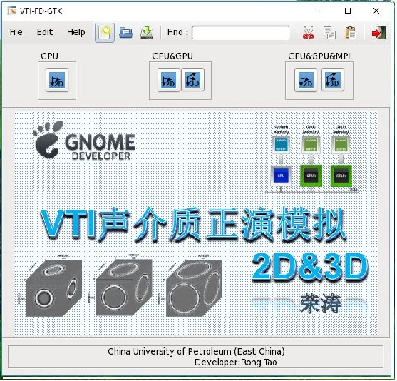
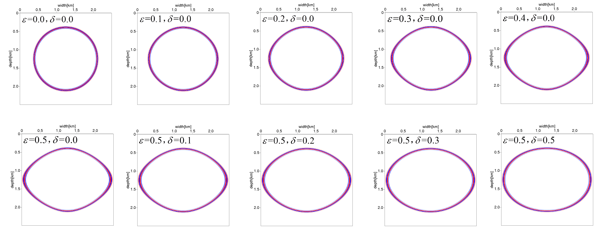
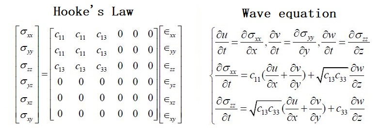

#  GPU NVIDIA CUDA  
This is a 2D and 3D VTI seismic finite difference forward modeling software based on NVIDIA GPU acceleration.
 

Anyone can use the software for learning. 
 

The main interface of the software is shown in the figure below
 



You can get the result.
 



Wave equation as follows:



## dependence & envrioment 
* Linux
* gcc
* cuda7.5+
* gtk+-2.0 || gtk+-3.0

## You can get the whole software from ```ALL.zip``` 

## Compiled and Run

```shell
$ make
$./binaryname
```
